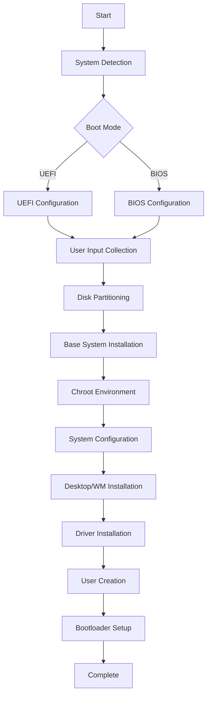

<div align="center">
  
# 🏹 **ARCHER**
### *Automated Arch Linux Installation Made Simple*

[](https://archlinux.org/)
[](https://www.gnu.org/software/bash/)
[](LICENSE)
[](https://github.com/piratheon/archer)


**Transform your Arch Linux installation from hours of manual configuration to minutes of automated setup**

[Features](#-features) • [Installation](#-installation) • [Usage](#-usage) • [Configuration](#-configuration) • [Contributing](#-contributing)

---

</div>

## 🎯 **Overview**

**Archer** is a powerful, dialog-driven installation script that automates the entire Arch Linux setup process. From partitioning to desktop environment installation, Archer handles everything while giving you complete control over your system configuration.

> 💡 **Perfect for both beginners wanting to experience Arch Linux and experts looking to save time on installations**

## ✨ **Features**

<table>
<tr>
<td width="50%">

### 🎨 **User Experience**
- 📊 **Interactive Dialog Interface** - Navigate with ease
- 🔄 **Real-time Progress Tracking** - Know what's happening
- ⚡ **Automatic Error Recovery** - Graceful handling of issues
- 🌍 **Localization Support** - Multiple keyboard layouts & timezones

</td>
<td width="50%">

### 🛠️ **Technical Capabilities**
- 🔧 **UEFI & BIOS Support** - Works on any system
- 💾 **Multiple Filesystems** - ext4, btrfs with subvolumes
- 🖥️ **6+ Desktop Environments** - GNOME to Hyprland
- 🎮 **GPU Driver Installation** - NVIDIA, AMD, Intel

</td>
</tr>
</table>

## 🚀 **Quick Start**

### Prerequisites
- Arch Linux Live USB/ISO
- Active internet connection
- Target disk for installation (will be wiped)

### One-Line Installation

```bash
curl -L https://raw.githubusercontent.com/piratheon/archer/main/archer.sh -o archer.sh && chmod +x archer.sh && ./archer.sh
```

## 📋 **Supported Configurations**

<details>
<summary><b>🖥️ Desktop Environments & Window Managers</b></summary>

| Environment | Description | Type |
|------------|-------------|------|
| **GNOME** | Modern and user-friendly desktop | Full DE |
| **KDE Plasma** | Feature-rich and highly customizable | Full DE |
| **XFCE** | Lightweight and stable | Full DE |
| **Cinnamon** | Traditional and intuitive | Full DE |
| **i3** | Popular tiling window manager | WM |
| **Hyprland** | Modern Wayland compositor | Compositor |
| **None** | Base system only | Terminal |

</details>

<details>
<summary><b>🎮 Graphics Drivers</b></summary>

- **NVIDIA** - Proprietary drivers with DKMS support
- **AMD** - Open-source AMDGPU drivers
- **Intel** - Integrated graphics support
- **Virtual** - VMware/VirtualBox guest additions

</details>

<details>
<summary><b>⚙️ Init Systems</b></summary>

- **systemd** - Standard Arch Linux init
- **OpenRC** - Dependency-based init system
- **runit** - Simple and fast init system

</details>

## 🎬 **Installation Walkthrough**

### Step 1: Boot & Launch
```bash
# Boot from Arch Linux ISO
# Connect to internet (wifi-menu or ethernet)
# Download and run Archer
./archer.sh
```

### Step 2: Configuration
The script will guide you through:

1. **🌐 Localization** - Keyboard layout and timezone
2. **💻 System** - Hostname and root password
3. **👤 User** - Create user with sudo privileges
4. **💾 Disk** - Select target disk and filesystem
5. **🖼️ Graphics** - Choose DE/WM and GPU drivers
6. **📦 Software** - Select additional applications

### Step 3: Sit Back & Relax
Archer will:
- ✅ Partition and format your disk
- ✅ Install base system with pacstrap
- ✅ Configure bootloader (GRUB)
- ✅ Set up networking
- ✅ Install selected desktop environment
- ✅ Configure graphics drivers
- ✅ Create user accounts
- ✅ Install additional software

## 🏗️ **Architecture**



## 📁 **Project Structure**

```
archer/
├── archer.sh           # Main installation script
├── README.md          # This file
├── LICENSE            # MIT License
└── docs/
    ├── TROUBLESHOOTING.md
    └── CUSTOMIZATION.md
```

## 🤝 **Contributing**

We welcome contributions! Please see our [Contributing Guidelines](CONTRIBUTING.md) for details.

### Development Setup
```bash
git clone https://github.com/piratheon/archer.git
cd archer
# Make your changes
./test.sh  # Run tests
```

### Areas for Contribution
- 🌍 Additional language support
- 🖥️ More DE/WM options
- 🔧 Post-installation scripts
- 📝 Documentation improvements
- 🐛 Bug fixes

## 📊 **Statistics**

<div align="center">


</div>

## ⚠️ **Important Notes**

> **WARNING**: This script will **COMPLETELY WIPE** the selected disk. Ensure you have backups of any important data.

> **NOTE**: This script is designed for fresh installations only. Do not run on existing systems.

## 📜 **License**

This project is licensed under the MIT License - see the [LICENSE](LICENSE) file for details.

## 🙏 **Acknowledgments**

- The [Arch Linux](https://archlinux.org/) community
- Contributors and testers
- Dialog utility developers
- All the amazing open-source projects that make this possible

## 📞 **Support**

<div align="center">

**Need help? Found a bug?**

[](https://github.com/piratheon/archer/issues)
[](https://github.com/piratheon/archer/discussions)

</div>

---

<div align="center">

**Made with ❤️ by [piratheon](https://github.com/piratheon)**

⭐ **Star this project if you find it helpful!** ⭐

</div>
